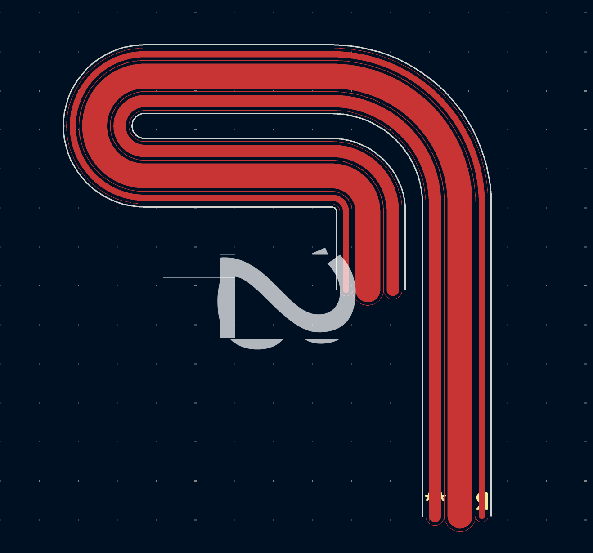

# KiCAD FPC Cable Generator

I've spent hours routing arcs in KiCAD for my flex PCB projects. Fed up with the process, I hacked this script together one night (with some LLM help) to generate cable footprints.

It's helpful if you need a custom FPC cable and want to quickly iterate on the bend angles and lengths. The script is written as a library, so you can import it and define your cables through code. I've provided an `example.py` to get you started.

### Usage

```bash
pip install KicadModTree # Used by the script to generate the footprints
python example.py
```

### Result



### The Cable Spec

```python
cable_top = Cable(0.4, 0.4, 0.4, 1.6, 0.4, 0.8, 0.4) # Alternates between gap, trace width
cable_bot = None # You can optionally have traces on both the top and bottom
sections = [
    Up(20), # Up 20mm
    Curve(8), # Arc of radius 8mm
    Right(12), # Now goes right
    Curve(3), # You get the point
    Down(0),
    Curve(3),
    Left(12),
    Curve(2.5),
    Down(5)
]
generate_cable("snake.kicad_mod", cable_top, cable_bot, sections)
```

This drops the cable in `snake.kicad_mod`. Re-running the script when you have changes then right-clicking the footprint and choosing *Update Footprint…* gives you a fast platform to iterate on designs.

## Tips and Tricks

- The `Cable` constructor will always have an odd array of parameters. 1 argument produces an empty cable with the specified width. 3 parameters produces a cable with a single trace and specified gaps on the left and right side. 5 parameters produces a cable with 2 traces.
- To do a 180 degree bend you'll need a sequence of `Curve(r), Down(0), Curve(r)` or `Curve(r), Up(0), Curve(r)`.
- This doesn't handle FPC connectors. I recommend recreating those from a datasheet directly.
- There's also an `Angle(length, angle_deg)` method you can use in place of `Up`/`Down`/`Left`/`Right` in case you need to make your cable go at 30/45/etc. degree slants. `Angle(10, 30)` will give you a 10mm segment oriented 30 degrees counter clockwise from `Right`.
